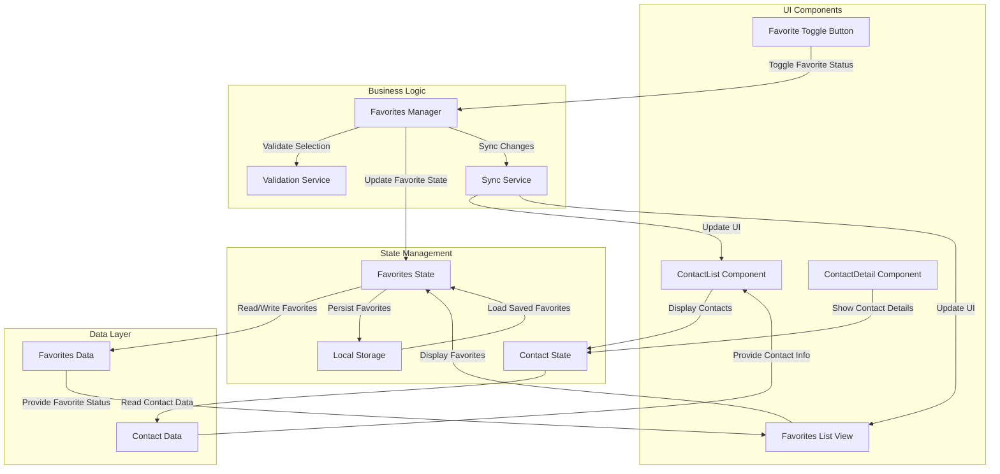

```mermaid
graph TD
    subgraph "UI Components"
        ContactList["ContactList Component"]
        ContactDetail["ContactDetail Component"]
        FavoriteToggle["Favorite Toggle Button"]
        FavoritesList["Favorites List View"]
    end

    subgraph "State Management"
        ContactState["Contact State"]
        FavoriteState["Favorites State"]
        LocalStorage["Local Storage"]
    end

    subgraph "Data Layer"
        ContactData["Contact Data"]
        FavoriteData["Favorites Data"]
    end

    subgraph "Business Logic"
        FavoriteManager["Favorites Manager"]
        ValidationService["Validation Service"]
        SyncService["Sync Service"]
    end

    %% UI Flow
    ContactList -->|"Display Contacts"| ContactState
    ContactDetail -->|"Show Contact Details"| ContactState
    FavoriteToggle -->|"Toggle Favorite Status"| FavoriteManager
    FavoritesList -->|"Display Favorites"| FavoriteState

    %% State Management Flow
    ContactState -->|"Read Contact Data"| ContactData
    FavoriteState -->|"Read/Write Favorites"| FavoriteData
    FavoriteState -->|"Persist Favorites"| LocalStorage
    LocalStorage -->|"Load Saved Favorites"| FavoriteState

    %% Business Logic Flow
    FavoriteManager -->|"Validate Selection"| ValidationService
    FavoriteManager -->|"Update Favorite State"| FavoriteState
    FavoriteManager -->|"Sync Changes"| SyncService
    SyncService -->|"Update UI"| ContactList
    SyncService -->|"Update UI"| FavoritesList

    %% Data Flow
    ContactData -->|"Provide Contact Info"| ContactList
    FavoriteData -->|"Provide Favorite Status"| FavoritesList
```